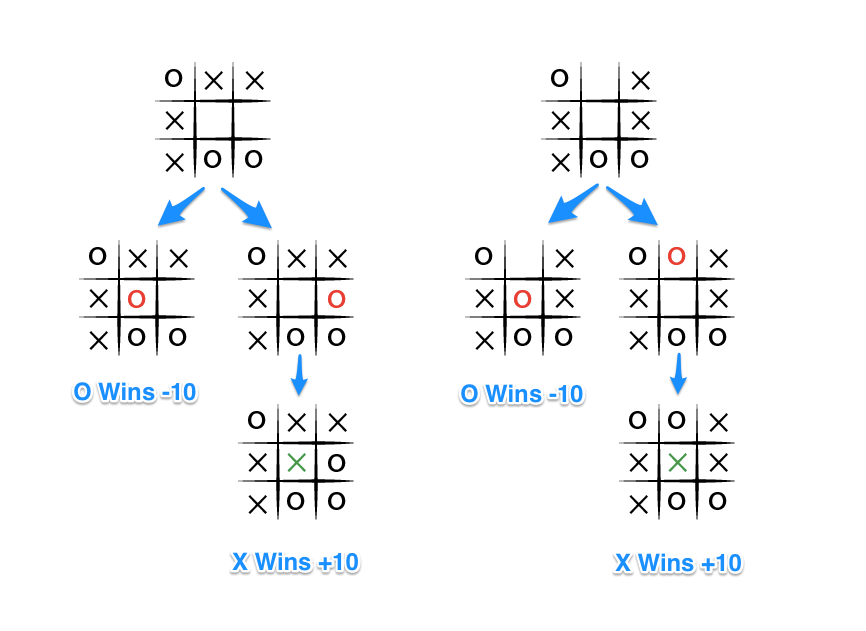

 

# Minimax Algorithm with Alpha-Beta Pruning

Minimax is a artificial intelligence algorithm applied to a two player Tic Tac Toe game. This games are known as zero-sum games, because in a mathematical representation: one player wins (+10) and other player loses (-10) or both of anyone not to win (0).

Minimax is a recursive algorithm which is used to choose the best move that leads the Max player to win or not lose (draw). It considers the current state of the game and the available moves at that state, then for each valid move, it plays (alternating min and max) until it finds a terminal state - win, draw, or lose.

Its goal is to minimize the maximum loss, i.e. minimize the worst-case scenario.

Explanation with Example

To apply this, let's take an example from near the end of a game, where it is my turn. I am X. My goal here, obviously, is to maximize my end game score.

If the top of this image represents the state of the game when it is my turn, then I have some choices to make, there are three places I can play, one of which clearly results in me winning and earning the 10 points. If I don't make that move, O could very easily win. And I don't want O to win, so my goal here, as the first player, should be to pick the maximum scoring move.

### But What About O?

We should assume that O is also playing to win this game, but relative to us, the first player, O wants obviously wants to choose the move that results in the worst score for us, it wants to pick a move that would minimize our ultimate score. Let's look at things from O's perspective, starting with the two other game states from above in which we don't immediately win.

The choice is clear, O would pick any of the moves that result in a score of -10.

### Describing Minimax with Alpha-Beta Pruning

The Minimax algorithm can be improved using Alpha-Beta Pruning, which reduces the number of nodes explored by the algorithm. This is done by adding two extra parameters alpha and beta to the algorithm. Alpha represents the maximum value that the maximizer (X) can guarantee, while beta represents the minimum value that the minimizer (O) can guarantee.

Here's a modified description of the algorithm with alpha-beta pruning, assuming X is the turn taking player:

- If the game is over, return the score from X's perspective.

- Otherwise get a list of new game states for every possible move.

- Initialize alpha to negative infinity and beta to positive infinity.

- For each of these states:

    - Call the minimax function recursively with the current state, opposite player's turn, alpha, and beta as parameters.

    - If it's X's turn:

        - Update alpha to the maximum of the current alpha and the returned value from the recursive call.

        - If alpha is greater than or equal to beta, break out of the loop.

    - If it's O's turn:

        - Update beta to the minimum of the current beta and the returned value from the recursive call.

        - If alpha is greater than or equal to beta, break out of the loop.

- If it's X's turn, return the maximum score from the scores list
