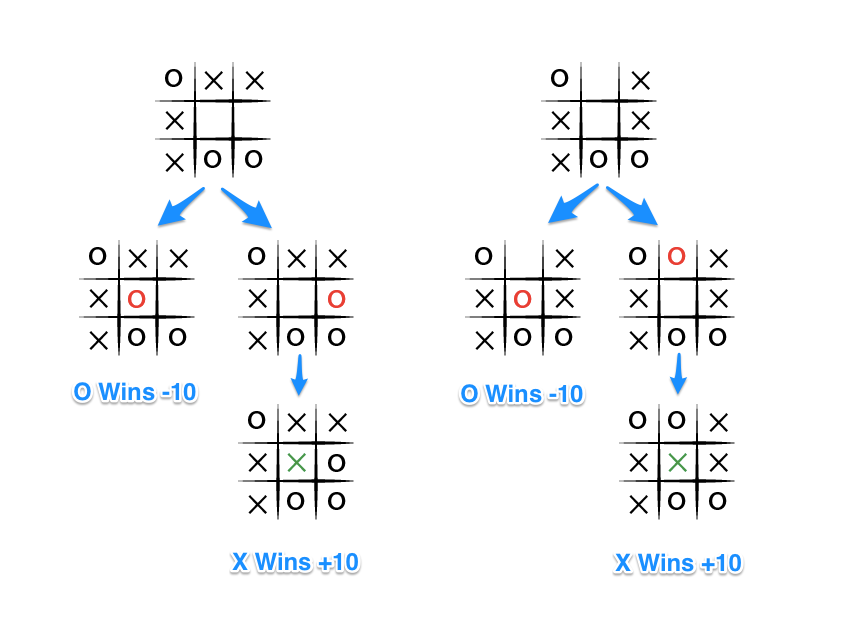

# AI Projects (CS235 / CS50AI)
This repository contains interactive projects related to Artificial Intelligence, which were developed as part of the CS 235 course at IIIT Guwahati.

Reference has been taken from Harvard's CS50AI course and TechWithTim.

## Projects
1. Tic Tac Toe 
2. Checkers
3. Sudoku Solver

Implementation of Game Theory, Min-Max algorithm, Alpha-Beta Pruning and SAT or SMT Solver.

### Tic Tac Toe
The Tic Tac Toe project is an implementation of the game using game theory concepts and algorithms. The computer player uses the Min-Max algorithm with Alpha-Beta pruning to decide its moves. The project is developed using Python programming language, and the user interface is built using the Pygame library.

### Checkers
Checkers is a two-player board game that is played on an 8x8 checkered board. Each player starts with 12 pieces called checkers, which are placed on the dark squares of the board. The objective of the game is to capture all of the opponent's pieces or block them so that they cannot make a move. The game involves strategic planning, and players need to think ahead to anticipate their opponent's moves. In this project, the game has been implemented using game theory concepts and algorithms like Min-Max with Alpha-Beta pruning to create an intelligent computer player.

### Sudoku Solver
A Sudoku puzzle is a 9x9 grid, where each cell can be filled with a number from 1 to 9. The goal of the Sudoku puzzle is to fill in the grid such that each row, column, and 3x3 subgrid contains all the numbers from 1 to 9. Solving a Sudoku puzzle involves finding an assignment of the variables that satisfies the Sudoku constraints. This is done using a SAT or SMT solver, where we can represent the puzzle as a Boolean formula in CNF.

## Installation
To run the projects, make sure you have Python 3.x installed on your system. To check, open the command prompt (Windows) or terminal (Mac/Linux) and type 'python --version'. 

If Python is not installed on your system, you can download and install it from the official Python website: https://www.python.org/downloads/


1. Clone the repository using the following command: 
   ```
   git clone https://github.com/aman247av/AI-Projects.git
   ```
   
2. Navigate to the project folder using the following command: 
   ```
   cd AI-Projects/<project-name>
   ```

3. Install the required packages using the following command: 
   ```
   pip install -r requirements.txt
   ```
   
4. Run the project using the following command: 
   ```
   python runner.py
   ```
   
# Minimax Algorithm with Alpha-Beta Pruning

Minimax is a artificial intelligence algorithm applied to a two player Tic Tac Toe game. This games are known as zero-sum games, because in a mathematical representation: one player wins (+10) and other player loses (-10) or both of anyone not to win (0).

Minimax is a recursive algorithm which is used to choose the best move that leads the Max player to win or not lose (draw). It considers the current state of the game and the available moves at that state, then for each valid move, it plays (alternating min and max) until it finds a terminal state - win, draw, or lose.

Its goal is to minimize the maximum loss, i.e. minimize the worst-case scenario.

Explanation with Example
To apply this, let's take an example from near the end of a game, where it is my turn. I am X. My goal here, obviously, is to maximize my end game score.


If the top of this image represents the state of the game when it is my turn, then I have some choices to make, there are three places I can play, one of which clearly results in me winning and earning the 10 points. If I don't make that move, O could very easily win. And I don't want O to win, so my goal here, as the first player, should be to pick the maximum scoring move.

### But What About O?
We should assume that O is also playing to win this game, but relative to us, the first player, O wants obviously wants to choose the move that results in the worst score for us, it wants to pick a move that would minimize our ultimate score. Let's look at things from O's perspective, starting with the two other game states from above in which we don't immediately win.

<p align="center"></p>
The choice is clear, O would pick any of the moves that result in a score of -10.

### Describing Minimax with Alpha-Beta Pruning
The Minimax algorithm can be improved using Alpha-Beta Pruning, which reduces the number of nodes explored by the algorithm. This is done by adding two extra parameters alpha and beta to the algorithm. Alpha represents the maximum value that the maximizer (X) can guarantee, while beta represents the minimum value that the minimizer (O) can guarantee.

<p align="center"></p>

Here's a modified description of the algorithm with alpha-beta pruning, assuming X is the turn taking player:

- If the game is over, return the score from X's perspective.
- Otherwise get a list of new game states for every possible move.
- Initialize alpha to negative infinity and beta to positive infinity.
- For each of these states:
    - Call the minimax function recursively with the current state, opposite player's turn, alpha, and beta as parameters.
    - If it's X's turn:
        - Update alpha to the maximum of the current alpha and the returned value from the recursive call.
        - If alpha is greater than or equal to beta, break out of the loop.
    - If it's O's turn:
        - Update beta to the minimum of the current beta and the returned value from the recursive call.
        - If alpha is greater than or equal to beta, break out of the loop.
- If it's X's turn, return the maximum score from the scores list

# SMT / SAT Solver 

### SAT Solver 
A SAT solver is a program that takes a Boolean formula and tries to find an assignment of the variables that makes the formula true. The Boolean formula is typically given in Conjunctive Normal Form (CNF), which is a conjunction of clauses, where each clause is a disjunction of literals. SAT solvers use a backtracking search algorithm to find a satisfying assignment for the formula.
##### Zchaff 
Zchaff is a high-performance SAT solver developed at Princeton University. It uses a combination of efficient data structures, search heuristics, and conflict analysis to find solutions to large and complex CNF formula.

### SMT Solver

A more powerful version of SAT solver that allows input formulas to include quantifiers, arithmetic, and other theories. SMT solver supports a range of theories such as linear arithmetic and bitvectors, and uses a combination of decision procedures and SAT solvers to find a satisfying assignment.
##### Z3Prove Solver
Z3Prove is a powerful open-source SMT solver developed by Microsoft Research. It supports a wide range of theories and has an efficient implementation. Z3Prove is widely used in formal verification and software testing.

### Formulation 
To solve a Sudoku puzzle using a SAT solver, we need to represent the Sudoku puzzle as a Boolean formula in Conjunctive Normal Form (CNF). We can introduce Boolean variables to represent the values in each cell, and then add clauses that enforce the Sudoku constraints. Let's see how to do this step by step.

Step 1: Variable representation

We represent the Sudoku puzzle as a 9x9 grid, where each cell can be filled with a number from 1 to 9. We can introduce Boolean variables to represent the values in each cell. Let's use the notation x[i][j][k] to represent whether the cell (i,j) contains the number k. The Boolean variable x[i][j][k] will be true if the cell (i,j) contains the number k, and false otherwise.

Step 2: Clauses for cell assignment

We add clauses that ensure that each cell contains exactly one number from 1 to 9. For example, the following clause ensures that cell (i,j) contains exactly one number:

(x[i][j][1] ∨ x[i][j][2] ∨ ... ∨ x[i][j][9]) ∧
(¬x[i][j][1] ∨ ¬x[i][j][2]) ∧
(¬x[i][j][1] ∨ ¬x[i][j][3]) ∧
...
(¬x[i][j][8] ∨ ¬x[i][j][9])

The first part of the clause (x[i][j][1] ∨ x[i][j][2] ∨ ... ∨ x[i][j][9]) ensures that at least one number is assigned to cell (i,j). The second part of the clause (¬x[i][j][1] ∨ ¬x[i][j][2]) ensures that if cell (i,j) contains the number 1, it cannot contain the number 2. The third part of the clause (¬x[i][j][1] ∨ ¬x[i][j][3]) ensures that if cell (i,j) contains the number 1, it cannot contain the number 3, and so on.
We need to add such clauses for all 81 cells in the Sudoku puzzle.

Step 3: Clauses for row, column, and subgrid constraints

We add clauses that ensure that each row, column, and 3x3 subgrid contains all the numbers from 1 to 9. For example, the following clause ensures that row i contains all the numbers from 1 to 9:

(x[i][1][1] ∨ x[i][2][1] ∨ ... ∨ x[i][9][1]) ∧
(x[i][1][2] ∨ x[i][2][2] ∨ ... ∨ x[i][9][2]) ∧
... 
(x[i][1][9] ∨ x[i][2][9] ∨ ... ∨ x[i][9][9]) ∧
(¬x[i][1][1] ∨ ¬x[i][1][2]) ∧
(¬x[i][1][1] ∨ ¬x[i][1][3]) ∧
...
(¬x[i][8][8] ∨ ¬x[i][8][9]) ∧
(¬x[i][9][8] ∨ ¬x[i][9][9])

The first part of the clause (x[iì][1][1] ∨ x[i][2][1] ∨ ... ∨ x[i][9][1]) ensures that row i contains at least one number. The second part of the clause (¬x[i][1][1] ∨ ¬x[i][1][2]) ensures that if cell (i,1) contains the number 1, it cannot contain the number 2. The third part of the clause (¬x[i][1][1] ∨ ¬x[i][1][3]) ensures that if cell (i,1) contains the number 1, it cannot contain the number 3, and so on.

We need to add such clauses for all 9 rows, 9 columns, and 9 subgrids in the Sudoku puzzle.

Step 4: Clauses for initial assignments

We add clauses to enforce the initial assignments given in the Sudoku puzzle. For example, if the cell (1,1) is initially assigned the number 3, we add the clause x[1][1][3]. We add such clauses for all the initially assigned cells in the Sudoku puzzle.

Step 5: Solving the CNF formula

Once we have encoded the Sudoku puzzle as a CNF formula, we can use a SAT solver to find a satisfying assignment to the variables. If the SAT solver returns a satisfying assignment, we can extract the values of the variables and construct the solution to the Sudoku puzzle.

Z3Prove is an SMT solver that can be used to solve Sudoku puzzles encoded as CNF formulas, similar to how SAT solvers work. However, SMT solvers can handle formulas in richer logics that go beyond propositional logic, which allows us to encode more complex Sudoku constraints and improve the efficiency of the solver.

To use a SAT solver or an SMT solver to solve Sudoku puzzles, we need to write code that generates the CNF formulas corresponding to the Sudoku puzzles, and interface with the solver to solve the CNF formulas. There are many libraries and examples available in various programming languages that demonstrate how to do this.
