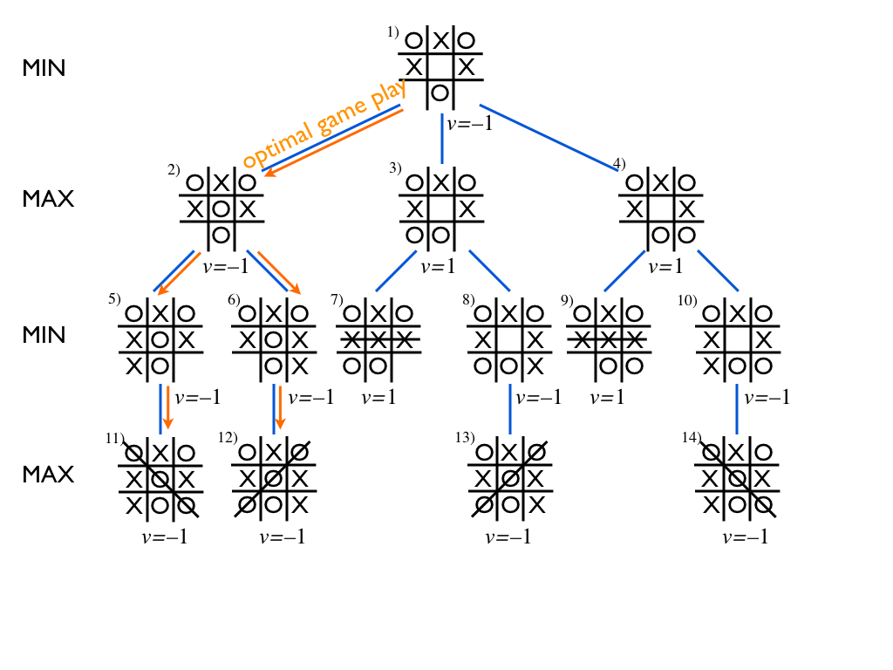

# AI Projects (CS235 / CS50 AI)
This repository contains interactive projects related to Artificial Intelligence, which were developed as part of the CS 235 course at IIIT Guwahati.

Reference has been taken from Harvard's CS50 AI course and TechWithTim.

## Projects
1. Tic Tac Toe 
2. Checkers

Implementation of Game Theory, Min-Max algorithm, and Alpha-Beta Pruning.

### Tic Tac Toe
The Tic Tac Toe project is an implementation of the game using game theory concepts and algorithms. The computer player uses the Min-Max algorithm with Alpha-Beta pruning to decide its moves. The project is developed using Python programming language, and the user interface is built using the Pygame library.

### Checkers
Checkers is a two-player board game that is played on an 8x8 checkered board. Each player starts with 12 pieces called checkers, which are placed on the dark squares of the board. The objective of the game is to capture all of the opponent's pieces or block them so that they cannot make a move. The game involves strategic planning, and players need to think ahead to anticipate their opponent's moves. In this project, the game has been implemented using game theory concepts and algorithms like Min-Max with Alpha-Beta pruning to create an intelligent computer player.

## Installation
To run the projects, make sure you have Python 3.x installed on your system. To check, open the command prompt (Windows) or terminal (Mac/Linux) and type 'python --version'. 

If Python is not installed on your system, you can download and install it from the official Python website: https://www.python.org/downloads/


1. Clone the repository using the following command: 
   ```
   git clone https://github.com/aman247av/AI-Projects.git
   ```
   
2. Navigate to the project folder using the following command: 
   ```
   cd AI-Projects/<project-name>
   ```

3. Install the required packages using the following command: 
   ```
   pip install -r requirements.txt
   ```
   
4. Run the project using the following command: 
   ```
   python runner.py
   ```
   
## Minimax Algorithm with Alpha-Beta Pruning
Minimax is a artificial intelligence algorithm applied to a two player Tic Tac Toe game. This games are known as zero-sum games, because in a mathematical representation: one player wins (+10) and other player loses (-10) or both of anyone not to win (0).

Minimax is a recursive algorithm which is used to choose the best move that leads the Max player to win or not lose (draw). It considers the current state of the game and the available moves at that state, then for each valid move, it plays (alternating min and max) until it finds a terminal state - win, draw, or lose.

Its goal is to minimize the maximum loss, i.e. minimize the worst-case scenario.

Explanation with Example
To apply this, let's take an example from near the end of a game, where it is my turn. I am X. My goal here, obviously, is to maximize my end game score.


If the top of this image represents the state of the game when it is my turn, then I have some choices to make, there are three places I can play, one of which clearly results in me winning and earning the 10 points. If I don't make that move, O could very easily win. And I don't want O to win, so my goal here, as the first player, should be to pick the maximum scoring move.

### But What About O?
We should assume that O is also playing to win this game, but relative to us, the first player, O wants obviously wants to choose the move that results in the worst score for us, it wants to pick a move that would minimize our ultimate score. Let's look at things from O's perspective, starting with the two other game states from above in which we don't immediately win.

<p align="center"></p>
The choice is clear, O would pick any of the moves that result in a score of -10.

### Describing Minimax with Alpha-Beta Pruning
The Minimax algorithm can be improved using Alpha-Beta Pruning, which reduces the number of nodes explored by the algorithm. This is done by adding two extra parameters alpha and beta to the algorithm. Alpha represents the maximum value that the maximizer (X) can guarantee, while beta represents the minimum value that the minimizer (O) can guarantee.

<p align="center"></p>

Here's a modified description of the algorithm with alpha-beta pruning, assuming X is the turn taking player:

- If the game is over, return the score from X's perspective.
- Otherwise get a list of new game states for every possible move.
- Initialize alpha to negative infinity and beta to positive infinity.
- For each of these states:
    - Call the minimax function recursively with the current state, opposite player's turn, alpha, and beta as parameters.
    - If it's X's turn:
        - Update alpha to the maximum of the current alpha and the returned value from the recursive call.
        - If alpha is greater than or equal to beta, break out of the loop.
    - If it's O's turn:
        - Update beta to the minimum of the current beta and the returned value from the recursive call.
        - If alpha is greater than or equal to beta, break out of the loop.
- If it's X's turn, return the maximum score from the scores list
